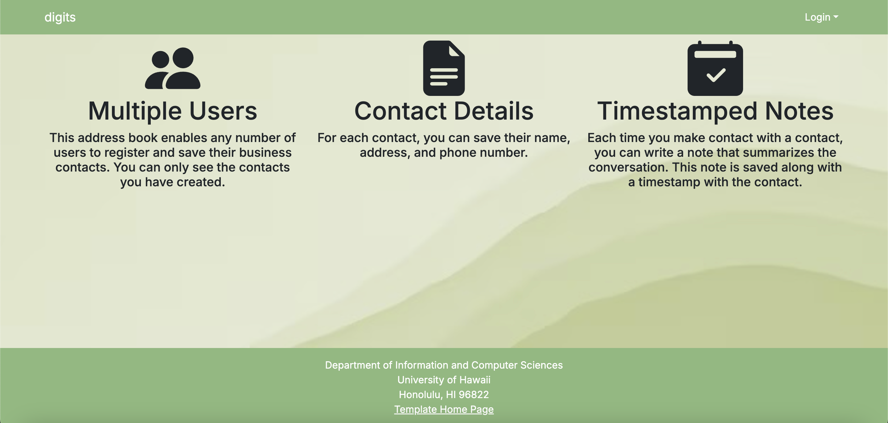
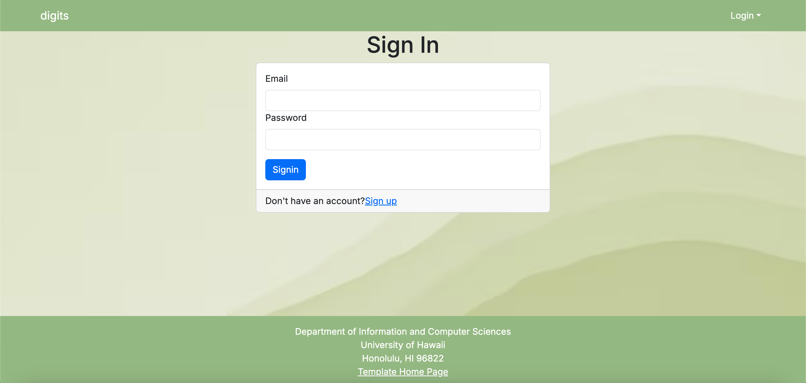
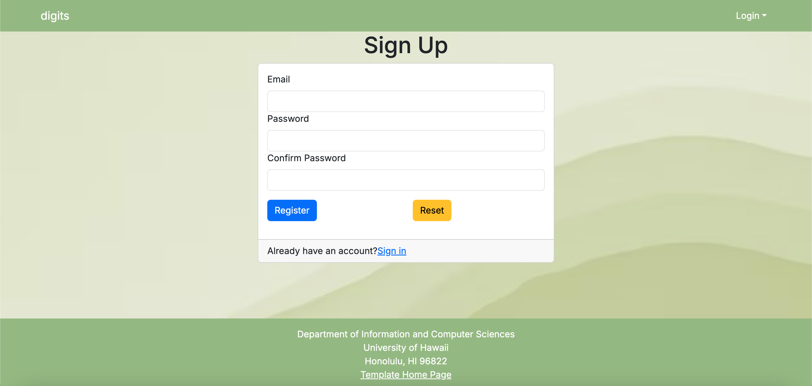
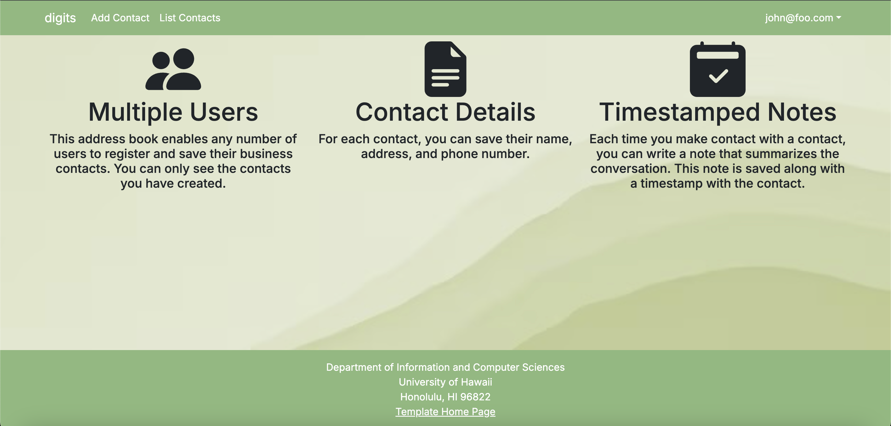
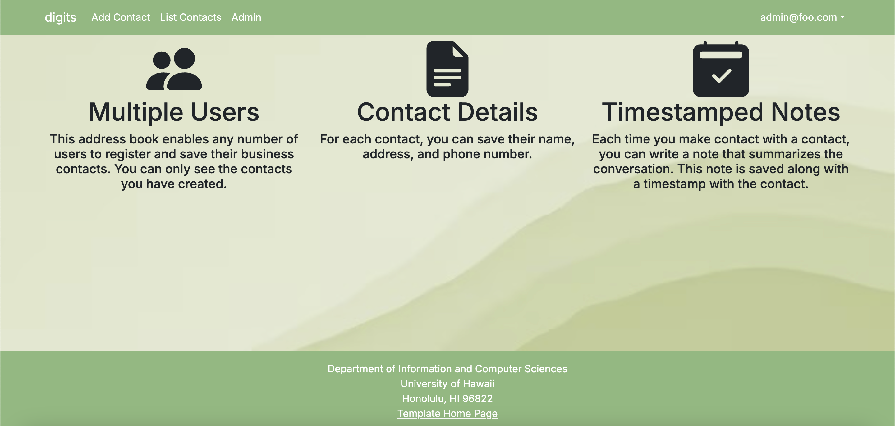
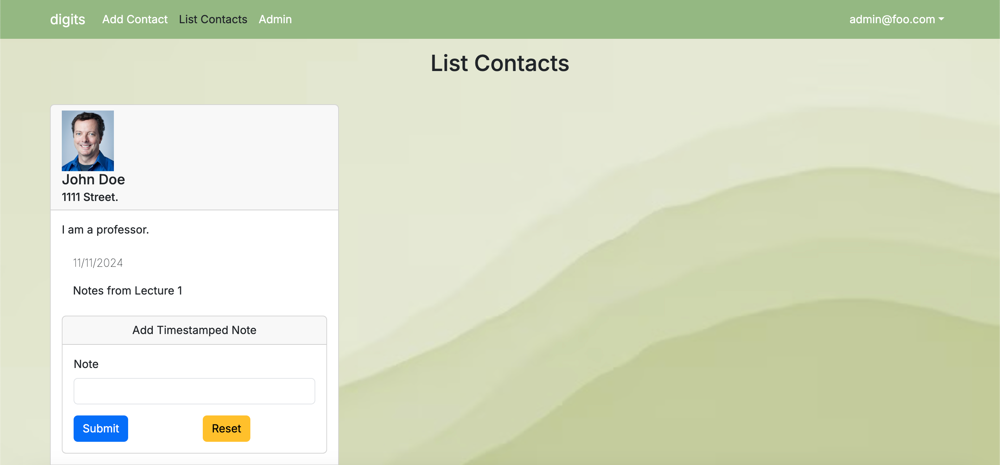
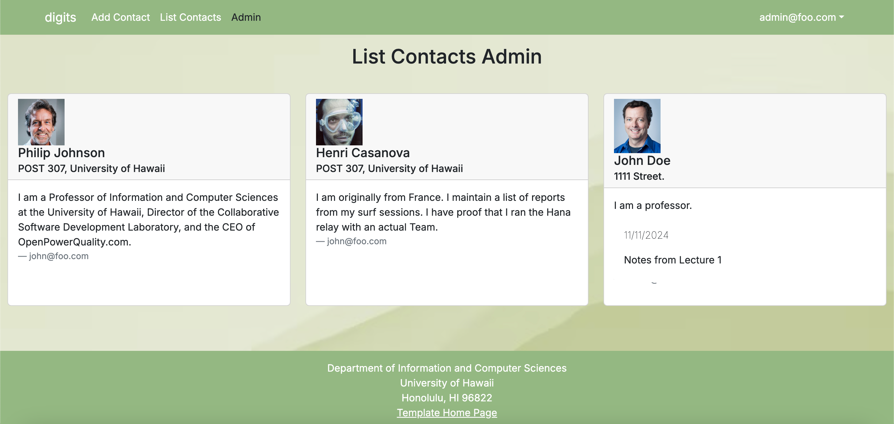
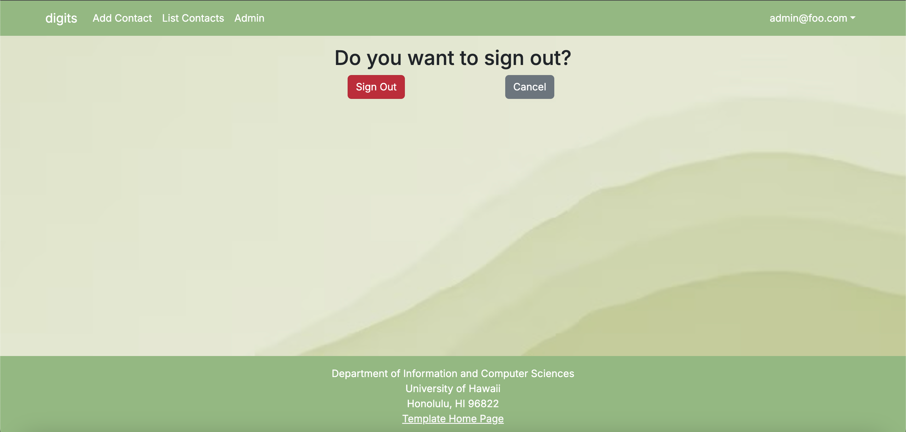
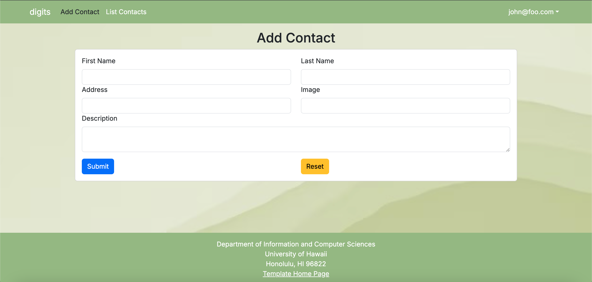
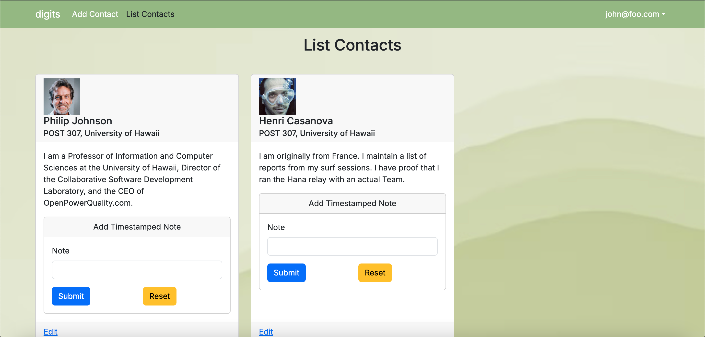

# Digits



## Installation

1. Download a copy of Digits.

2. `cd` into the directory of your local copy of the repo, and install third party libraries with:

```
npm install
```

3. Run the Prisma migration to set up the PostgreSQL tables:

```
npx prisma migrate dev
```

4. Seed the database:

```
npx prisma db seed
```

5. Once the libraries are installed and the database seeded, you can run the application by invoking the "dev" script:

```
npm run dev
```

6. You can verify that the code is formatted by running ESLint in the `src/` directory with:

```
npm run lint
```

## Walkthrough

The following sections describe the major features of this template.

<br>

#### Landing page

Landing page of the application:


<br>

#### Login page

Clicking on the Login link, then on the Sign In menu item displays this page:



<br>

#### Register page

Alternatively, clicking on the Login link, then on the Sign Up menu item displays this page:



<br>

#### Landing (after Login) page, non-Admin user

Once you log in (either to an existing account or by creating a new one), the navbar changes as follows:



<br>

#### Landing (after Login), Admin user

You can define an "admin" user in the settings.json file. This user, after logging in, gets a special entry in the navbar:



<br>

#### Admin List Contacts

This page shows any contacts that the admin has created. In this example, "John Doe" shows up because they are the only contact that the admin has created:



<br>

#### Admin page (Shows all the contacts)

To provide a simple example of a "super power" for Admin users, the Admin page lists all of the Contacts that any user has created.

In this example, 3 contacts appear (1 contact created by the admin@foo.com user, and 2 contacts from the john@foo.com user):



<br>

#### Sign Out page

You can sign out and login to a different account:



<br>

#### Add Contact Page

You can add a contact by clicking "Add Contact" on the navbar. You can be a regular user or an admin user to create a contact:



<br>

#### List Contacts Page

Lists all of the contacts that that specific user has created. This page does not show contacts that other users or admins have created:


